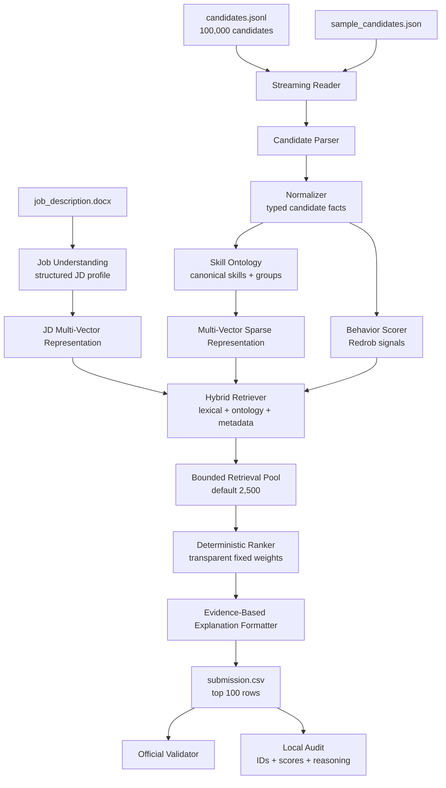

# Redrob Offline Candidate Ranker

Deterministic, CPU-only candidate discovery and ranking system for the **Redrob Data & AI Challenge: Intelligent Candidate Discovery & Ranking**.

The repository ranks a 100,000-candidate pool for Redrob AI's **Senior AI Engineer - Founding Team** job description and produces a challenge-compliant `submission.csv` containing the top 100 candidates with evidence-based reasoning.

This is not an LLM wrapper. The ranking path is an offline Python pipeline built around structured candidate parsing, a lightweight skill ontology, sparse multi-field representations, hybrid retrieval, behavioral signal integration, deterministic scoring, and validation guardrails.

## Badges

Suggested badges for GitHub:

```md


```

## Project Overview

The challenge is to identify the strongest candidates for a nuanced senior AI engineering role. The job description explicitly warns against naive keyword matching: the right candidate is someone who has built production retrieval, ranking, matching, search, or recommendation systems and is actually reachable as a candidate.

The implemented system:

- Streams `candidates.jsonl` instead of loading the full 487 MB file into memory.
- Parses candidate records into normalized facts.
- Uses a small hand-authored skill ontology to normalize and expand relevant concepts.
- Builds separate sparse representations for summary/title, skills, experience, education, and ontology signals.
- Retrieves a bounded candidate pool with hybrid lexical, ontology, metadata, and behavioral evidence.
- Reranks candidates with a transparent deterministic scoring formula.
- Generates reasoning from computed evidence only.
- Writes and validates the required CSV format.

## Motivation

Recruiting systems fail when they optimize for the easiest signal: keyword overlap. For this job, that is actively dangerous. A candidate can list "RAG", "Pinecone", and "LLM" while having no production ML systems experience. Another candidate may have built a recommendation system at scale but use different terminology in their profile.

The implementation therefore treats candidate fit as a combination of:

1. **Technical relevance**: retrieval, ranking, evaluation, Python, ML systems.
2. **Career evidence**: work history showing shipped systems, not just listed skills.
3. **Product context**: experience closer to product/platform environments than service-only delivery.
4. **Behavioral availability**: open-to-work status, activity recency, response rate, notice period, and interview reliability.
5. **Explainability**: every top-100 row should be defensible to a recruiter and to hackathon reviewers.

## What Is Actually Implemented

Implemented:

- Offline ranking CLI: `rank.py`
- JSONL and JSON-array candidate input support
- Structured JD profile loader with DOCX extraction support
- Candidate parsing and normalization
- Lightweight skill ontology and role/company helpers
- Multi-vector sparse candidate and JD representations
- Hybrid retrieval into a bounded pool
- Behavioral scoring over Redrob signals
- Deterministic final ranker with explicit tie-breaking
- Evidence-based explanation formatter
- Official CSV format validation through `validate_submission.py`
- Additional local audit through `audit_submission.py`
- Unit tests for core behavior
- Small-sample demo configuration

Not implemented:

- Hosted LLM calls during ranking
- GPU inference
- FAISS, Qdrant, Elasticsearch, or another vector database
- Sentence-transformer/BGE/E5 embedding model inference
- Supervised learning-to-rank model
- Web UI or recruiter dashboard
- Fairness dashboard
- Persistent feedback loop

Those items are listed later as possible future improvements, not as completed features.

## Key Features

### Constraint-Aware Ranking

The Redrob submission specification forbids hosted LLM/API calls, GPU usage, and network access during ranking. This repository keeps the ranking path deterministic and offline.

### Multi-Field Candidate Representation

Candidates are not reduced to a single text blob. The system keeps separate sparse vectors for:

- Summary/title
- Skills
- Experience descriptions
- Education
- Ontology concepts

This follows the architecture intent of multi-vector representation while avoiding external model artifacts.

### Lightweight Skill Ontology

The ontology maps important synonyms and related concepts:

- `FAISS`, `Milvus`, `Qdrant`, `Pinecone`, `Elasticsearch` -> `vector_database`
- `BM25`, `dense retrieval`, `sparse retrieval` -> `hybrid_search`
- `NDCG`, `MRR`, `MAP`, `Precision@K` -> `evaluation`
- `recommendation`, `recommender`, `matching` -> `recommendations`

The ontology is intentionally small and auditable. It is not a full knowledge graph.

### Behavioral Intelligence

Redrob behavioral signals are treated as first-class ranking evidence. The behavior module scores:

- Open-to-work flag
- Last active date
- Recruiter response rate
- Average response time
- Interview completion rate
- Offer acceptance rate
- Profile completeness
- Notice period
- Relocation willingness
- GitHub activity score
- Email, phone, and LinkedIn verification

Candidates not marked open to work are hard-filtered by default, with a fallback path in retrieval if the pool is otherwise too small.

### Trap Resistance

The ranker applies penalties when skill claims are not supported by career evidence. Examples:

- Many AI skills but a non-technical title and weak career evidence.
- Multiple advanced/expert skills with very low duration.
- Large skill list with little shipped-system evidence.
- High skill match but low career evidence.

This is evidence-based trap avoidance. The implementation does not special-case honeypot candidate IDs.

### Evidence-Based Explanations

The explanation formatter uses only parsed facts and score breakdowns. It does not call a language model and cannot invent new skills, companies, or experience.

Each reasoning string typically includes:

- Current title
- Years of experience
- Matched skill or ontology concepts
- Product/company context
- Behavioral availability summary
- Response rate
- Notice period
- Confidence proxy
- One concern, when relevant

## Repository Structure

```text
.
├── rank.py                         # Main production ranking CLI
├── audit_submission.py             # Local audit wrapper
├── validate_submission.py          # Official challenge validator
├── config.sample.json              # Small-sample/demo config
├── requirements.txt                # Runtime has no external dependencies
├── submission.csv                  # Generated final top-100 submission
├── sample_ranked.csv               # Generated small-sample demo output
├── redrob_ranker/
│   ├── audit.py                    # Candidate-ID, score, and reasoning audit
│   ├── behavior.py                 # Redrob behavioral signal scoring
│   ├── candidate.py                # Candidate parsing and normalization
│   ├── config.py                   # Ranking and behavior weights
│   ├── explainability.py           # Evidence-based reasoning strings
│   ├── job_understanding.py        # Structured JD profile and DOCX extraction
│   ├── logging_utils.py            # CLI logging setup
│   ├── ontology.py                 # Lightweight skill/role/company ontology
│   ├── orchestrator.py             # End-to-end workflow
│   ├── ranking.py                  # Deterministic final scoring
│   ├── representation.py           # Sparse multi-vector representation
│   ├── retrieval.py                # Hybrid retrieval and bounded shortlist
│   ├── submission.py               # CSV writer and output guardrails
│   └── text.py                     # Text normalization and tokenization
└── tests/
    └── test_ranker.py              # Unit tests for core scoring/audit behavior

```

Challenge files included in the workspace:

- `candidates.jsonl`
- `candidate_schema.json`
- `job_description.docx`
- `redrob_signals_doc.docx`
- `submission_spec.docx`
- `sample_candidates.json`
- `sample_submission.csv`
- `submission_metadata_template.yaml`

## Complete Architecture Overview

The repository implements a modular offline ranking pipeline:

1. Load and structure the JD.
2. Stream candidates from JSONL or JSON sample input.
3. Parse each candidate into typed facts.
4. Canonicalize skills and match ontology concepts.
5. Build sparse multi-field representations.
6. Score behavioral availability and reliability.
7. Retrieve a bounded candidate pool using hybrid evidence.
8. Rerank retrieved candidates with deterministic scoring.
9. Generate evidence-based explanations.
10. Write a challenge-compliant CSV.
11. Validate and audit the output.

## Mermaid Architecture Diagram



## System Pipeline

### 1. Job Understanding

`redrob_ranker.job_understanding` loads the JD and returns a structured `JobProfile`. The current implementation includes a static reviewed parse of the Senior AI Engineer role and can extract DOCX text using Python's standard library.

Why this approach:

- The challenge has one released JD.
- The JD interpretation was reviewed during architecture work.
- A deterministic static parse avoids introducing hosted LLM calls during ranking.

Alternative considered:

- LLM-based JD parsing. This was rejected for the ranking path because hosted LLM/API calls are not allowed during challenge reproduction.

### 2. Candidate Parsing and Normalization

`redrob_ranker.candidate` converts raw records into `CandidateFacts`, `SkillFact`, and `CareerFact`.

Normalization includes:

- Defensive integer/float parsing.
- Career field extraction.
- Skill canonicalization.
- Text token generation.
- Redrob signal preservation.

Why this approach:

- It keeps downstream modules independent from raw JSON shape.
- It makes scoring easier to audit.
- It supports both `candidates.jsonl` and JSON sample arrays.

### 3. Ontology Matching

`redrob_ranker.ontology` provides the lightweight skill, title, company, industry, and location helpers.

Why this approach:

- It captures common synonym relationships without external model dependencies.
- It is small enough to review manually.
- It supports explanations because canonical matches are explicit.

Alternative considered:

- Full knowledge graph. This was considered too heavy for the challenge scope and not necessary for a one-JD offline ranker.

### 4. Sparse Multi-Vector Representation

`redrob_ranker.representation` builds a `MultiVector` using `Counter` objects for:

- Summary
- Skills
- Experience
- Education
- Ontology

Why this approach:

- It preserves field-level signal separation.
- It is deterministic and dependency-free.
- It respects the architecture's multi-vector recommendation while meeting offline constraints.

Alternative considered:

- Dense sentence embeddings. This would be a better semantic retrieval layer if local model artifacts were available, but this repository does not include such models and the ranking path must reproduce without network access.

### 5. Hybrid Retrieval

`redrob_ranker.retrieval` scores each streamed candidate using:

- Summary overlap
- Skill overlap
- Experience overlap
- Ontology overlap
- Technical title metadata
- Product-industry metadata
- Service-company penalty context
- Experience-range fit
- Behavioral score modifier

It keeps only a bounded heap of the strongest candidates. Default retrieval pool size is 2,500.

Why this approach:

- It avoids ranking all 100,000 candidates with expensive final scoring logic.
- It keeps memory usage predictable.
- It provides recall from multiple evidence types rather than one keyword list.

### 6. Behavioral Scoring

`redrob_ranker.behavior` computes a normalized behavior score and records concerns.

Default behavior weights:

| Signal group | Weight |
|---|---:|
| Open to work | 0.18 |
| Recency | 0.18 |
| Response rate | 0.18 |
| Response speed | 0.08 |
| Interview completion | 0.10 |
| Offer acceptance | 0.05 |
| Profile completeness | 0.07 |
| Notice period | 0.06 |
| Relocation | 0.04 |
| GitHub activity | 0.03 |
| Verification | 0.03 |

Why this approach:

- The JD explicitly says availability matters.
- Behavioral signals are often the difference between "qualified" and "hireable."
- Treating behavior separately keeps the explanation and scoring auditable.

### 7. Deterministic Ranking

`redrob_ranker.ranking` computes a final `ScoreBreakdown`.

Default ranking weights:

| Component | Weight |
|---|---:|
| Skill match | 0.24 |
| Career evidence | 0.23 |
| Title fit | 0.13 |
| Ranking/evaluation evidence | 0.10 |
| Production context | 0.10 |
| Experience range | 0.08 |
| Logistics | 0.05 |
| Education | 0.03 |
| Open-source / GitHub signal | 0.04 |

The final score also applies:

- Behavior modifier
- Retrieval contribution
- Trap penalty
- Service-only penalty
- Hard penalty for candidates not open to work

Tie-breaking is deterministic:

1. Higher final score
2. Higher skill match
3. Higher career evidence
4. Higher behavior score
5. Distance from 7 years of experience
6. Candidate ID

Why this approach:

- There is no labeled training data for supervised learning-to-rank.
- The scoring formula can be defended in review.
- Deterministic output is important for hiring-related systems and hackathon reproduction.

### 8. Explanation Generation

`redrob_ranker.explainability` formats each reasoning string from the final `RankedCandidate`.

Why this approach:

- It prevents hallucinated candidate claims.
- It keeps reasoning consistent with the score breakdown.
- It provides enough specificity for manual review without exposing unnecessary personal data.

### 9. Submission and Audit

`redrob_ranker.submission` writes the official CSV columns:

```text
candidate_id,rank,score,reasoning
```

`audit_submission.py` adds local checks not covered by the official validator:

- Candidate IDs exist in the source pool.
- Row count matches expectation.
- Scores are monotonic and varied.
- Reasoning is present and non-identical.
- Summary statistics are printed.

## Quick Start

### Requirements

- Python 3.11 or newer recommended.
- No runtime third-party packages are required by the ranker.
- No GPU.
- No network access needed during ranking.

`requirements.txt` is intentionally empty except for a comment because the production ranking path uses the Python standard library.

### Run the Full Production Ranking

```bash
python rank.py --candidates ./candidates.jsonl --out ./submission.csv
```

### Validate the Submission

```bash
python validate_submission.py ./submission.csv
python audit_submission.py --submission ./submission.csv --candidates ./candidates.jsonl
```

### Run Tests

```bash
python -m unittest discover -s tests
```

### Run the Small-Sample Demo

```bash
python rank.py --candidates ./sample_candidates.json --config ./config.sample.json --out ./sample_ranked.csv
python audit_submission.py --submission ./sample_ranked.csv --candidates ./sample_candidates.json --expected-rows 10
```

## Configuration

Optional JSON config overrides are supported:

```bash
python rank.py --candidates ./sample_candidates.json --config ./config.sample.json --out ./sample_ranked.csv
```

Example `config.sample.json`:

```json
{
  "output_rows": 10,
  "retrieval_pool_size": 50,
  "final_review_pool": 50,
  "hard_filter_open_to_work": false
}
```

The production defaults live in `redrob_ranker.config.RankerConfig`.

## Performance and Evaluation

Latest verified local checks:

```text
python -m unittest discover -s tests
.....
Ran 5 tests in 0.019s
OK
```

```text
python validate_submission.py ./submission.csv
Submission is valid.
```

```text
python audit_submission.py --submission ./submission.csv --candidates ./candidates.jsonl
rows=100, score_min=0.748301, score_median=0.774050, score_max=0.863626,
top_titles=[('Recommendation Systems Engineer', 16), ('Applied ML Engineer', 10),
('Search Engineer', 10), ('AI Engineer', 8), ('AI Research Engineer', 7),
('Junior ML Engineer', 7), ('Senior Data Scientist', 7), ('Data Scientist', 6)]
Audit passed.
```

Observed production run:

```text
Parsed and behavior-scored 100000 candidates
Retrieved 2500 candidates for final scoring
Wrote 100 rows to submission.csv in 165.09s
```

The challenge scoring ground truth is hidden, so this README does not claim a leaderboard score. The available evaluation evidence is format validation, local audit, runtime, and sanity checks over the final top-100 distribution.

## Final Output

The generated `submission.csv` has 100 ranked candidates plus the header.

Top rows from the current output:

```csv
candidate_id,rank,score,reasoning
CAND_0077337,1,0.863626,"Staff Machine Learning Engineer with 7.0 yrs; matches the JD through Feature Engineering, embeddings, evaluation, fine-tuning and product-company evidence. Behavior is recently active: response rate 0.95, notice 60 days, confidence 0.97."
CAND_0017960,2,0.855809,"Recommendation Systems Engineer with 7.7 yrs; matches the JD through cloud infra, data engineering, embeddings, evaluation and product-company evidence. Behavior is recently active: response rate 0.72, notice 60 days, confidence 0.94."
CAND_0064326,3,0.843957,"Search Engineer with 7.6 yrs; matches the JD through data engineering, embeddings, evaluation, BM25 and product-company evidence. Behavior is recently active: response rate 0.94, notice 45 days, confidence 0.95."
```

## Engineering Decisions and Trade-offs

### Standard Library Runtime

Decision: keep the ranking path dependency-free.

Why:

- Avoids dependency installation failures in Stage 3 reproduction.
- Avoids network access during ranking.
- Keeps runtime behavior inspectable.

Trade-off:

- Sparse lexical/ontology representations are less semantically rich than dense embeddings.

### Sparse Multi-Vector Instead of Dense Embeddings

Decision: implement multi-vector retrieval using sparse `Counter` features.

Why:

- The architecture called for multi-vector representation.
- No local embedding model artifacts were available in the repository.
- Hosted embedding APIs are not allowed during ranking.

Trade-off:

- The system relies on curated ontology and lexical evidence. It may miss some paraphrased semantic matches that a strong local embedding model could capture.

### Deterministic Formula Instead of Supervised LTR

Decision: use fixed weights for final ranking.

Why:

- No labeled training set is available.
- The architecture review recommended avoiding supervised LTR until feedback data exists.
- Fixed weights are transparent and auditable.

Trade-off:

- Weights are expert-designed, not learned from historical hiring outcomes.

### Template-Based Explanation Instead of LLM Explanation

Decision: generate explanations from computed facts only.

Why:

- Hosted LLM calls are not allowed during ranking.
- LLM-generated explanations can hallucinate.
- Manual review rewards reasoning grounded in candidate facts.

Trade-off:

- Explanations are less linguistically varied than an LLM could produce, but they are safer and easier to audit.

### Evidence-Based Honeypot Avoidance

Decision: penalize suspicious profile patterns rather than hard-code candidate IDs.

Why:

- Hard-coding honeypot IDs would not generalize.
- The challenge expects careful profile inspection, not ID blacklists.

Trade-off:

- Heuristic penalties may not catch every synthetic trap and may down-rank some unusual but valid profiles.

## Engineering Challenges

### Challenge: Ranking 100,000 Profiles Under 5 Minutes

The full candidate file is large enough that a naive in-memory or per-candidate model call strategy would be fragile. The pipeline streams records, uses bounded heaps for retrieval, and performs final ranking only over the retrieval pool.

### Challenge: Distinguishing AI Skill Claims From AI Work

The dataset contains profiles where skills, titles, summaries, and career histories can contradict each other. The ranker therefore scores career evidence and title fit separately from the skill list.

### Challenge: Explainability Without Hallucination

The reasoning column matters in manual review. The explanation formatter is intentionally constrained to score breakdown facts, which reduces fluency but improves truthfulness.

### Challenge: Constraint Tension With the Original Architecture

The architecture documents discussed embeddings and LLM-assisted refinement. The challenge reproduction rules prohibit hosted LLM/API calls and network access during ranking, and the repository does not include local model artifacts. The implementation preserves the architecture's module boundaries but adapts model-dependent pieces into offline deterministic components.

## Scalability Considerations

Current scalability properties:

- Streams candidates from disk.
- Keeps only a bounded retrieval pool in memory.
- Uses standard-library data structures.
- Avoids per-candidate external calls.
- Produces deterministic output for the same inputs/config.

Likely bottlenecks at larger scale:

- Python tokenization and ontology matching are single-process.
- Sparse lexical matching is less efficient than a production inverted index.
- The ontology is manually curated and small.

Reasonable production upgrades:

- Precompute candidate features.
- Use a real inverted index for lexical retrieval.
- Use a local embedding model with precomputed vectors if model artifacts are allowed.
- Store candidate features in a columnar format.
- Parallelize parsing/scoring batches.

## Production Readiness

Ready for the hackathon reproduction path:

- Single-command CSV generation.
- Offline CPU-only execution.
- No hosted APIs.
- Official validator passing.
- Local audit passing.
- Small-sample demo path.
- Tests for core modules.

Not production-ready as a hiring product:

- No recruiter UI.
- No online feedback loop.
- No fairness/bias monitoring dashboard.
- No calibrated score validation against historical hiring labels.
- No model/feature monitoring.
- No access control or privacy layer.

The repository should be read as a strong offline ranking engine and challenge submission, not a complete enterprise recruiting platform.

## Screenshots

No UI screenshots are available because this repository is a command-line ranking system.

Suggested placeholders for GitHub:

```md
<!-- Add screenshot: terminal run of python rank.py -->
<!-- Add screenshot: validate_submission.py passing -->
<!-- Add screenshot: sample_ranked.csv preview -->
<!-- Add diagram export from the Mermaid architecture above -->
```

## Future Improvements

The following are future work, not currently implemented:

- Local dense embedding model with precomputed candidate vectors.
- FAISS/Qdrant/OpenSearch-backed retrieval.
- Supervised learning-to-rank after collecting recruiter labels.
- Expanded skill ontology with versioning and tests.
- Fairness and bias monitoring over protected or proxy attributes where legally appropriate.
- Recruiter-facing review UI.
- Human-in-the-loop feedback capture.
- Batch parallel scoring.
- More comprehensive integration tests over synthetic trap candidates.
- Model/card-style documentation for scoring weights and limitations.

## Submission Assets

Primary assets:

- `submission.csv`: final generated top-100 CSV.
- `rank.py`: reproduction entrypoint.
- `redrob_ranker/`: source package.
- `validate_submission.py`: official validator.
- `audit_submission.py`: local audit.
- `README.md`: repository documentation.
- `docs/submission_checklist.md`: pre-upload checklist.
- `requirements.txt`: runtime dependency declaration.

## License

No license file is currently included in this workspace. If this repository is published publicly, add an explicit license before release. MIT is a reasonable choice for a hackathon utility repository if there are no team or organizer restrictions.

Suggested `LICENSE` badge if MIT is added:

```md

```

## Suggested GitHub Topics

```text
redrob
hackathon
candidate-ranking
recruitment-ai
offline-ranking
information-retrieval
hybrid-retrieval
explainable-ai
behavioral-signals
python
cpu-only
deterministic-ranking
talent-intelligence
```

## Suggested Repository Description

Offline deterministic candidate ranking system for the Redrob Data & AI Challenge, combining structured parsing, lightweight ontology matching, behavioral signals, hybrid retrieval, transparent scoring, and evidence-based explanations.

## Suggested Repository Tagline

Offline, explainable candidate ranking under real hackathon constraints.
